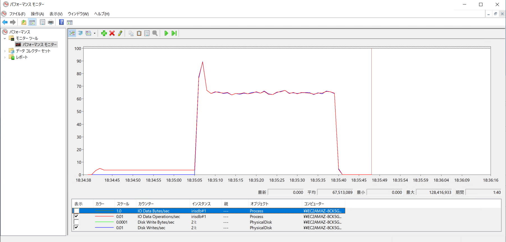

# パフォーマンス計測

## 使用AWSインスタンスについて

|インスタンス|	vCPU*|	メモリ (GiB)|	ストレージ|	専用 EBS 帯域幅 (Mbps)|	ネットワークパフォーマンス ***|
|:---|:---|:---|:---|:---|:---|
|m4.xlarge|	4|	16|	EBS のみ|	750|	高|
|i3.xlarge|	4|	30.5|	EBS,1 x 950 NVMe SSD|表記なし,850?|	ベース 1.25Gbps,バースト帯域幅 10Gbps |

使用O/S: ami-windows-latest/Windows_Server-2019-Japanese-Full-Base  

> Provisioningは[こちら](https://github.com/IRISMeister/AWSIRISDeployment)の[MirrorNode_Windows.yam](https://github.com/IRISMeister/AWSIRISDeployment/blob/master/MirrorNode_Windows.yaml)使用して自動化している。  
> 特に断りがなければ、計測にはm4.xlargeを使用している。

EBS 最適化インスタンスの諸元値
|インスタンスサイズ|	最大帯域幅 (Mbps)|	最大スループット (MB/秒､128 KiB I/O)|	最大 IOPS (16 KiB I/O)|
|:---|:---|:---|:---|
|m4.xlarge|	750|	93.75|	6,000|
|i3.xlarge|	850|	106.25|	6,000|

> 750 Mbps=93.75 MB/秒,850 Mbps=106.25 MB/秒  
> 6000 * 16 KiB=96 MiB/秒  
> いずれも、バーストの無いインスタンスタイプなので、安定したパフォーマンス特性を持つモデルとして使用可能。

インスタンスストアボリュームのSSD I/O パフォーマンス( IOPS (4,096 バイトブロックサイズ))
|インスタンスサイズ|	100% のランダム読み取り時 IOPS|	書き込み IOPS|
|:---|:---|:---|
|i3.xlarge|	206,250|	70,000|
> 「100% のランダム読み取り」とは？  
> Linuxに関するドキュメントから抜粋。Windowsに関しては発見できず。同じか？  
> ネットワークと異なり、SSD I/Oについてはバーストは無い模様。


EBSの諸元値
|ボリュームタイプ|ボリュームあたりの最大 IOPS (16 KiB I/O)|ボリュームあたりの最大スループット|備考|
|:---|:---|:---|:---|
|GP3|16,000|1,000 MiB/秒||
|GP2|16,000|250 MiB/秒* ||
|IO2|64,000|1,000  MiB/秒* ||
|IO2BE|256,000|4,000  MiB/秒 |参考値。m4,i3では選択不可|

今回はGP2に2,000MB割り当てているので、固定で250MiB/秒の性能となるが、一般的には下記の条件が付く。  
>スループットの制限は、ボリュームサイズに応じて 128 MiB/秒〜250 MiB/秒です。170 GiB 以下のボリュームの最大スループットは 128 MiB/秒です。170 GiB より大きく 334 GiB より小さいボリュームは、バーストクレジットを利用できる場合、最大スループット 250 MiB/秒を提供します。334 GiB 以上のボリュームであれば、バーストクレジットに関係なく 250 MIB/S を配信できます。作成された日が 2018 年 12 月 3 日以前であり、作成後に変更されていない gp2 ボリュームの場合は、 そのボリュームを変更しない限り、完全なパフォーマンスが得られない場合があります


特定のインスタンスタイプでio2を指定するとio2beになる。
> io2 Block Express ボリュームは、R5b、X2idn、X2iedn インスタンスでのみサポートされます。これらのインスタンスにアタッチされた io2 ボリュームは、起動中または起動後に自動的に Block Express で実行されます。

https://aws.amazon.com/jp/ec2/instance-types/  
https://docs.aws.amazon.com/ja_jp/AWSEC2/latest/UserGuide/storage-optimized-instances.html  
https://docs.aws.amazon.com/ja_jp/AWSEC2/latest/UserGuide/ebs-volume-types.html  
https://docs.aws.amazon.com/ja_jp/AWSEC2/latest/UserGuide/ebs-optimized.html  


## 使用DISKデバイスについて

|ドライブ|EBS|用途|DAT初期/最大サイズ(GB)|Path|PIOPS|備考|
|:---|:---|:---|:---|:---|:---|:---|
|H|GP3|IRIS本体|N/A|H:\InterSystems\IRIS|6000|WIJ,temp|
|I|GP3|DAT|10/10|I:\DBGP3\IRIS.DAT|6000||
|||DAT|48/|I:\ZRANREAD\IRIS.DAT|6000|RANREADで使用|
|J|GP3|ジャーナル|N/A|J:\iris\jrnl\pri|6000||
|K|GP3|DAT|10/10|K:\DBGP3K\IRIS.DAT|6000||
|L|GP2|DAT|10/10|K:\DBGP2\IRIS.DAT|N/A|6000 IOPS|
|M|GP3|DAT|10/10|M:\DBGP3M\IRIS.DAT|6000||
|N|NVMe|DAT|48/|N:\ZRANREAD\IRIS.DAT||RANREADで使用,i3.xlarge使用時|
|N|IO2|DAT|10/10|N:\DBIO2\IRIS.DAT|6000|io2使用時|

> GP2のIOPSは3 IOPS/GB

## fioによるディスク性能計測

### fioについて
https://ci.appveyor.com/project/axboe/fio  
(Environment: ARCHITECTURE=x64, CONFIGURE_OPTIONS=, DISTRO=cygwinにあるfio-3.29-x64.msiを使用)  
https://fio.readthedocs.io/en/latest/fio_doc.html#command-line-options

https://nbisco.hatenablog.com/entry/2015/12/14/001614
```
ramp_time=30       # I/Oかけはじめの、性能測定はしない時間。
                   # I/Oかけはじめは安定しないこともあるので、
                   # 少し時間を置くほうがよいこともある。
runtime=60         # I/Oをかけて、性能測定をする時間。
time_based=1       # filesize分I/Oかけても、runtimeが経過するまで
                   # I/Oをかけ続ける。
numjobs=6          # いくつのプロセスでI/Oするかを指定。
                   # thread=1とすると、forkではなく
                   # pthreadを使ってくれる。
```
https://www.n0derunner.com/2021/05/understanding-fio-norandommap-and-randrepeat-parameters/

With randommap enabled (the default) fio ensures that every block in the LBA range is read, but in a random order. You can use the norandommap in the fio file to change that behavior to be truly random.

size指定したサイズのI/Oを完了するまで実行されるが、時間指定で実行することも出来る。下記はrandom readを30秒間実行(--time_based=1 --runtime=30)する例。
```
$ fio --name randread --direct=1 --rw=randread --bs=8k --iodepth=1 --numjobs=1 --time_based=1 --runtime=30 --group_reporting --norandommap
```

### パラメータの決定
IRISのデフォルトのデータベースブロックサイズが8KiBなので--bs=8k(BlockSize 8k)、Windows版IRISのWDはデフォルトでasync I/Oなのでdirect=1を固定で指定する。

```
L:\>fio --bs=8k --direct=1 --size=1g
```

>linixの場合は--ioengine=libaioを追加する。  
>Winodwsの場合は--threadを追加を追加する。--ioengineは省略時値のwindowsaio。  

sizeは低速なディスクの場合1G,高速なディスクの場合5Gを使用。実行する時間指定での計測(time_based)も可能だが、今回は使用せず。  

IRISのWrite Daemonの動作に近づくよう、bssplitを使用しての可変のI/Oサイズ指定や、thinktime_blocksを使用しての休止期間の調整なども可能だが、今回は使用せず。
> 理由は何秒でグローバルバッファが満杯になるかという変数が机上で定まらないから。  

```
I:\>fio --name=write --iodepth=1 --rw=write --direct=1 --size=10g --numjobs=1 --thread -group_reporting --iopsavgtime=1000 -bssplit=8k/20:16k/10:32k/10:512k/60 -thinktime=8000000 -thinktime_blocks=500
```

### Windowsパフォーマンスモニタ、AWS CloudWatchによる計測値との関係

fioの出力値を実測IOPSとして記録する。Windows パフォーマンスモニタ、CloudWatchの計測値と一致することは確認済み。
CloudWatchは詳細モニタリングを有効化して1分毎にサンプリング。  
> 詳細モニタリングを有効にすると、インスタンスの 1 分間隔のモニタリンググラフが Amazon EC2 コンソールに表示されます。 追加料金が適用されます 

CloudWatchは個々のボリューム選択後に選べる「モニタリング」タブから表示したダッシュボード上の「読み込みスループット (操作/秒)」を使用。  
1分間隔(詳細モニタリングを有効時のサンプリング周期と同じ)の平均でグラフを表示させる。  

> 30秒間隔などを選ぶと、表示される値が実際の2倍になるので注意...。


## 計測

### シーケンシャルWRITE

#### fio

実行コマンド例
```
I:\>fio --name=write --iodepth=1 --rw=write --bs=8k --direct=1 --size=1g --numjobs=4 --thread -group_reporting --iopsavgtime=1000
```
> -group_reportingを付けないと結果がJOBの数だけ分割されてしまい集計が大変になる。出力例は[こちら](result/fio_result_example.txt)。

実際には、[バッチファイル](run-fio.bat)を使用して一括で計測。
> ディスク性能に見合ったパラメータ設定で実行しないと、終了予定まで500日～などとなり、いつまでも完了しないので注意。


Lドライブ(GP2)
|rw|iodepth|numjobs|IOPS|BW(MiB/s)|備考|
|:---|:---|:---|:---|:---|:---|
|write|1|1|1383|10.8|1JobではMAXまで到達しない|
|write|1|2|1453|11.4||
|write|1|4|5242|41.0||
|write|4|1|5470|42.7||
|write|1|8|6135|47.9||

Iドライブ(GP3)
|rw|iodepth|numjobs|IOPS|BW(MiB/s)|備考|
|:---|:---|:---|:---|:---|:---|
|write|1|1|1111|8.9|1JobではMAXまで到達しない|
|write|1|2|1142|9.1||
|write|1|4|4331|33.8||
|write|4|1|4512|35.3||
|write|1|8|6111|47.7||

Iドライブ(IO2)
|rw|iodepth|numjobs|IOPS|BW(MiB/s)|備考|
|:---|:---|:---|:---|:---|:---|
|write|1|1|1662|13.0|1JobではMAXまで到達しないがIOPSは向上|
|write|1|2|1722|13.5||
|write|1|4|5899|46.1||
|write|4|1|5721|44.7||
|write|1|8|6136|47.9||

> 単体JOBでの性能が改善する(よりLatencyが少ない)と期待しての計測

i3.xlargeでの計測値　　
Nドライブ(NVMe)
|rw|iodepth|numjobs|IOPS|BW(MiB/s)|備考|
|:---|:---|:---|:---|:---|:---|
|write|1|8|47.2k|369||

#### IRIS

IRIS 8000 MB Global Buffer(large pages)  

CASE 1) ジャーナルなし。タイトトループ内で異なるディスクにシーケンシャルに書き込みを行う。並列実行数3。
```
Process #1
DBGP3>k ^data1
DBGP3>D DISABLE^%NOJRN k data s $P(data,"a",256)="a" F i=1:1:8834947 { S ^data1(i)=data }
Process #2
DBGP3K>k ^data1
DBGP3K>D DISABLE^%NOJRN k data s $P(data,"a",256)="a" F i=1:1:8834947 { S ^data1(i)=data }
Process #3
DBGP3M>k ^data1
DBGP3M>D DISABLE^%NOJRN k data s $P(data,"a",256)="a" F i=1:1:8834947 { S ^data1(i)=data }
```
これらの処理が継続している間にWindows Perfmonから各指標を目視。
> 目視なので計測精度はいまひとつ。

- m4.xlargeの場合

| Drive| 用途 | MAX MB/S | AVG MB/S| MAX IOPS|AVG IOPS |備考|
|:---|:---|:---|:---|:---|:---|:---|
| H | WIJ | 111.6 | 49.4 | 1045|238||
| I | DAT | 93.9 | 14.1 |179 |28|I/Oピーク時に帯域が飽和|
| K | DAT | 93.8 | 13.8 |179 |27||
| M | DAT | 93.8 | 13.8 |179 |27||


インスタンスの最大スループットが93.75 MB/Sなので、WIJ及び各DATが配置されたディスクのMB/Sが(IOPS上限よりも先に)上限に達しているものと理解できる。
> WIJを配置したディスクのMAX MB/Sが111.6に達している理由は不明。計測誤差？

GP3の最大スループットは1,000 MiB/s、GP2の最大スループットは250 MiB/sなので、この状態であれば、「最大スループット上限がより多いインスタンスタイプ」に変更することによりパフォーマンス向上が見込める。

- i3.xlargeの場合

m4.xlargeの場合と異なり、インスタンスストアボリュームであるNドライブにデータベースを3個作成し、3並列で更新を行う。
| Drive| 用途 | MAX MB/S | AVG MB/S| MAX IOPS|AVG IOPS |備考|
|:---|:---|:---|:---|:---|:---|:---|
| H | WIJ | 199 | 88.8 | 977|449||
| N | DAT | 727.0 |86  | 1395|166||

> まだ余裕がある。

CASE 2) CASE 1のジャーナルあり版。

| Drive| 用途 | MAX MB/S | AVG MB/S| MAX IOPS|AVG IOPS |備考|
|:---|:---|:---|:---|:---|:---|:---|
| H | WIJ |82.9|24.2|812|116||
| J | JRN |77.5|49.2|199|57||
| I | DAT |93.7|6.4|179|13|I/Oピーク時に帯域が飽和|
| K | DAT |89.1|7.6|170|15||
| M | DAT |93.7|6.1|179|12||

このケースでも、DATのスループットが上限に達していると思われる。これは更新負荷がブロックが純増するSet命令(シーケンシャルライト)なので、IRIS.DATへの書き込み先が連続しており、I/Oサイズが8KB以上のサイズになっているため。 
> そのためIOPSも低下する 

ランダムアクセスでの更新であれば、書き込み先のブロックは非連続となるため、IOPSは増えるはず。それを試すためにランダムWRITEのCASE 1を実施。


### シーケンシャルREAD

#### fio

Lドライブ(GP2)
|rw|iodepth|numjobs|IOPS|BW(MiB/s)|備考|
|:---|:---|:---|:---|:---|:---|
|read|1|1|2794|21.8|1JobではMAXまで到達しない|
|read|1|2|3188|24.9||
|read|1|4|5574|43.6||
|read|4|1|6353|49.6||
|read|1|8|6127|47.9||

> read 1ジョブの結果がなぜか期待値の倍くらいになっている。結果は[こちら](result/gp2/read-1.txt)。GP2は単一プロセスによる書き込みに"強い"のかもしれない。  
> m4.xlargeの最大スループットは93.75 MB/sなので、帯域の頭打ちは観測されていない。  

Iドライブ(GP3)
|rw|iodepth|numjobs|IOPS|BW(MiB/s)|備考|
|:---|:---|:---|:---|:---|:---|
|read|1|1|1234|9.9|1JobではMAXまで到達しない|
|read|1|2|2372|18.5||
|read|1|4|4806|37.6||
|read|4|1|4866|38.0||
|read|1|8|6115|47.8||

Iドライブ(io2)
|rw|iodepth|numjobs|IOPS|BW(MiB/s)|備考|
|:---|:---|:---|:---|:---|:---|
|read|1|1|4156|32.5|GP3と比べて1 JOB性能も向上|
|read|1|2|5462|42.7||
|read|1|4|5159|40.3||
|read|4|1|5171|40.4||
|read|8|1|6133|47.9||


GP2,GP3共に、期待通りのIOPS(6,000)前後に達している。全般にGP2のほうがGP3よりやや高IOPSになっている傾向がみられる。

i3.xlargeでの計測値　　
Nドライブ(NVMe)
|rw|iodepth|numjobs|IOPS|BW(MiB/s)|備考|
|:---|:---|:---|:---|:---|:---|
|read|1|1|7457|58.3||
|read|1|4|25.5k|199||
|read|1|8|49.0k|383||
|read|1|16|84.8k|663||
|read|1|32|122k|952|CPU 95+%|

> i3.xlargeのインスタンスストアボリュームのIOPS(4KB)の限界値はランダムリードで206,250、書き込みで70,000であることを念頭に。BWについては記載がない。
> size=5gにした以外は同じ。


#### IRIS

事前準備として、下記コマンドにて、10GB(10,240MB)のデータベースがあふれる程度のグローバル(4個)で満たしておく。
```
DBGP3>s $P(data,"a",256)="a"
DBGP3>D DISABLE^%NOJRN　F i=1:1 { S ^data(i)=data If (i#10000)=0 { W i,!  } }
          ^
<FILEFULL> ^data(35339791),i:\dbgp3\
DBGP3>w 35339791/4
8834947.75
DBGP3>D DISABLE^%NOJRN k ^data F i=1:1:8834947 { S ^data1(i)=data,^data2(i)=data,^data3(i)=data,^data4(i)=data If (i#10000)=0 { W i,! } }
```

IRIS 32 MB Global Buffer (Global Bufferの最小サイズ)  

CASE 1) グローバル1個をシーケンシャルにREAD。  
```
DBGP3>F i=1:1:8834947 { S data=^data1(i) }
```
CASE 2) グローバル2個をシーケンシャルにREAD。  
```
Process #1
DBGP3>F i=1:1:8834947 { S data=^data1(i) }
Process #2
DBGP3>F i=1:1:8834947 { S data=^data2(i) }
```

CASE 3) グローバル4個をシーケンシャルにREAD。  
```
Process #1
DBGP3>F i=1:1:8834947 { S data=^data1(i) }
Process #2
DBGP3>F i=1:1:8834947 { S data=^data2(i) }
Process #3
DBGP3>F i=1:1:8834947 { S data=^data3(i) }
Process #4
DBGP3>F i=1:1:8834947 { S data=^data4(i) }
```

結果  
Iドライブ(GP3)
|rw| numjobs| QUE Len | IOPS|備考|
|:---|:---|:---|:---|:---|
| read | 1 | 1 | 1650| CASE 1 |
| read | 2 | 2 | 3210| CASE 2 |
| read | 4 | 4 | 6120| CASE 3 |


READ性能がリニアに向上。IRISのREAD単位は8KB固定なので、(WRITEの場合とは異なり)IOPS上限で頭打ちとなる。

### ランダムREAD

#### fio

Lドライブ(GP2)
|rw|iodepth|numjobs|IOPS|BW(MiB/s)|備考|
|:---|:---|:---|:---|:---|:---|
|rndr|1|8|6101|47.7||

Iドライブ(GP3)
|rw|iodepth|numjobs|IOPS|BW(MiB/s)|備考|
|:---|:---|:---|:---|:---|:---|
|rndr|1|8|6063|47.4||

Iドライブ(IO2)
|rw|iodepth|numjobs|IOPS|BW(MiB/s)|備考|
|:---|:---|:---|:---|:---|:---|
|rndr|1|8|6060|47.3||


#### IRIS

IRIS　RANREADを使用したREAD計測を実施。  
https://community.intersystems.com/post/random-read-io-storage-performance-tool  
IRISのキャッシュの影響を受けないViewコマンドでデータベースを読み込むため、Global Bufferのサイズの影響を受けない。ディスクの読み込み性能を比較するのに有益なツール。

##### 事前準備

48GBのデータベースを作成。ログレベル1を指定。
```
USER>do $SYSTEM.OBJ.Load("C:\random-read-performance-tool-master\PerfTools.RanRead.xml","ck")
USER>do ##class(PerfTools.RanRead).Setup("I:\ZRANREAD","ZRANREAD",48,1)
```

##### 計測実行
並列実行するジョブ数1,4,8,16、繰り返し回数30000を指定。
```
USER>do ##class(PerfTools.RanRead).Run("I:\ZRANREAD",4,30000)
 
InterSystems Random Read IO Performance Tool
--------------------------------------------
Creating 4 processes in the background.
Starting 4 processes now!
To terminate run:  do ##class(PerfTools.RanRead).Stop()
Waiting to finish......................
Random read background jobs finished.
4 processes (30000 iterations) average response time = .666ms
Calculated IOPS = 6006
```

##### 結果の閲覧
```
SELECT RunDate,RunTime,Database,Iterations,Processes,
    {fn ROUND(AVG(ResponseTime),2)} As ResponseTime,
    {fn ROUND(AVG(IOPS),0)} As IOPS
FROM PerfTools.RanRead
GROUP BY Batch
```

m4.xlarge+GP3の場合
```
RunDate RunTime Database        Iterations      Processes       ResponseTime  IOPS
66203   45046   I:\ZRANREAD\    30000   4       .67     6011
66203   45222   I:\ZRANREAD\    30000   8       1.3     6136
66203   45290   I:\ZRANREAD\    30000   16      2.6     6144
66203   45452   I:\ZRANREAD\    30000   1       .63     1597
```

m4.xlarge+IO2の場合
```
RunDate RunTime Database        Iterations      Processes       ResponseTime  IOPS
66212	49732	I:\ZRANREAD\	30000	16	2.6	6147
66212	50086	I:\ZRANREAD\	30000	8	1.3	6135
66212	50140	I:\ZRANREAD\	30000	4	.66	6093
66212	50169	I:\ZRANREAD\	30000	1	.63	1579
```

i3.xlarge(DBにインスタンスストアボリュームを使用)の場合 
```
RunDate	RunTime	Database	Iterations	Processes	ResponseTime	IOPS
04/06/2022	14:01:27	N:\ZRANREAD\	30000	1	0.17	5882
04/06/2022	14:02:27	N:\ZRANREAD\	30000	4	0.18	21739
04/06/2022	14:02:45	N:\ZRANREAD\	30000	8	0.20	40176
04/06/2022	14:04:03	N:\ZRANREAD\	30000	16	0.24	67212
```

##### 結果
|インスタンスタイプ| numjobs| Iterate | QUE Len | IOPS|平均応答時間(ms)|備考|
|:---|:---|:---|:---|:---|:---|:---|
|m4.xlarge| 1 | 30000 | 1 | 1597| 0.63||
|m4.xlarge| 4 | 30000 | 4 | 6011| 0.67 |IOPSが飽和|
|m4.xlarge| 8 | 30000 | 8 | 6136| 1.3 |IOPSが飽和|
|m4.xlarge| 16 | 30000 | 16 | 6144| 2.6|IOPSが飽和|
|m4.xlarge(IO2)| 1 | 30000 || 1579 | 0.63 | GP3/1 JOBと比べてほぼ改善見られず|
|m4.xlarge(IO2)| 4 | 30000 || 6093 | 0.66 | IOPSが飽和|
|m4.xlarge(IO2)| 8 | 30000 || 6135 | 1.30 | IOPSが飽和|
|m4.xlarge(IO2)| 16 | 30000 || 6147 | 2.60 | IOPSが飽和|
|i3.xlarge| 1 | 30000 |  | 5882| 0.17||
|i3.xlarge| 4 | 30000 |  | 21739| 0.18 ||
|i3.xlarge| 8 | 30000 |  | 40176| 0.20 ||
|i3.xlarge| 16 | 30000 |  | 67212| 0.24||
|i3.xlarge| 32 | 30000 |  | 99608| 0.32||
|i3.xlarge| 64 | 30000 |  | 96304| 0.67|CPUが飽和|


### ランダムWRITE

#### fio

Lドライブ(GP2)
|rw|iodepth|numjobs|IOPS|BW(MiB/s)|備考|
|:---|:---|:---|:---|:---|:---|
|rndw|1|8|4025|31.4||

Iドライブ(GP3)
|rw|iodepth|numjobs|IOPS|BW(MiB/s)|備考|
|:---|:---|:---|:---|:---|:---|
|rndw|1|8|4022|31.4||

Iドライブ(IO2)
|rw|iodepth|numjobs|IOPS|BW(MiB/s)|備考|
|:---|:---|:---|:---|:---|:---|
|rndw|1|8|4026|31.5||


i3.xlargeでの計測値　　
Nドライブ(NVMe)
|rw|iodepth|numjobs|IOPS|BW(MiB/s)|備考|
|:---|:---|:---|:---|:---|:---|
|rndw|1|8|18.4k|144||

#### IRIS

IRISの場合、ランダムWRITE時は必ずランダムREADを伴うので、fioによる計測とは単純比較できない事に留意。

CASE 1) シーケンシャルWRITEのCASE 2実施後に実施する。サイズが変わらないランダムアクセスの更新を行う。

```
Process #1
DBGP3>s max=$O(^data1(""),-1) F i=1:1:max { k data s l=$C($R(27)+1+$A("a")) s $P(data,l,256)=l S ^data1($R(max)+1)=data }
Process #2
DBGP3K>s max=$O(^data1(""),-1) F i=1:1:max { k data s l=$C($R(27)+1+$A("a")) s $P(data,l,256)=l S ^data1($R(max)+1)=data }
Process #3
DBGP3M>s max=$O(^data1(""),-1) F i=1:1:max { k data s l=$C($R(27)+1+$A("a")) s $P(data,l,256)=l S ^data1($R(max)+1)=data }
```

| Drive| 用途 | MAX MB/S | AVG MB/S| MAX IOPS|AVG IOPS |備考|
|:---|:---|:---|:---|:---|:---|:---|
| H | WIJ |123.3|44.6|899|214||
| J | JRN |66.2|4.2|201|6||
| I | DAT |113.0|10.2|10933|1000||
| K | DAT |94.0|15.2|8866|1337||
| M | DAT |122.3|15.7|11387|1361||

ランダムアクセスになったため、DATのIOPSが大幅に増加したのは予想通り。
IOPS上限値の6000を超えたのは想定外。  
スループットが微増したのは予想外。ブロックの新規割り当てコストが大きいのか。サイズが不変(ブロックの再編成が起こらない)であることも要因と思われるので、それを試すためにCASE 4を実施。

CASE 2) シーケンシャルWRITEのCASE 2あるいは3の実施後に実施する。サイズが大きく変わるランダムアクセスの更新を行う。

```
Process #1
DBGP3>s max=$O(^data1(""),-1) F i=1:1:max { k data s l=$C($R(27)+1+$A("a")) s $P(data,l,200+$R(56))=l S ^data1($R(max)+1)=data }
Process #2
DBGP3K>s max=$O(^data1(""),-1) F i=1:1:max { k data s l=$C($R(27)+1+$A("a")) s $P(data,l,200+$R(56))=l S ^data1($R(max)+1)=data }
Process #3
DBGP3M>s max=$O(^data1(""),-1) F i=1:1:max { k data s l=$C($R(27)+1+$A("a")) s $P(data,l,200+$R(56))=l S ^data1($R(max)+1)=data }
```
| Drive| 用途 | MAX MB/S | AVG MB/S| MAX IOPS|AVG IOPS |備考|
|:---|:---|:---|:---|:---|:---|:---|
| H | WIJ |94.0|52.2|367|202||
| J | JRN |23.0|6.4|164|63||
| I | DAT |76.5|6.5|279|23||
| K | DAT |87.0|27.0|314|93||
| M | DAT |76.4|1.7|8752|193||

予想通りパフォーマンスが低下。ブロックの再編成が多発していると思われる。
> ブロックの再編成の発生回数を知る方法があると便利。


## IRISのI/O動作を観察する方法

### irisstat

```
$ irisstat -c-1

WD Phase: 8: Database write phase

Number Of Blocks/Write For Each Write Daemon
 WD #   #blk/wrt=1  #blk/wrt=2  #blk/wrt=3  #blk/wrt=4  #blk/wrt=5  #blk/wrt=6
    0           19          53           5           1           4           0
 WD #   #blk/wrt=7  #blk/wrt=8  #blk/wrt=9 #blk/wrt=10 #blk/wrt=11 #blk/wrt=12
    0            2           0           2           2           0           3
 WD #  #blk/wrt=13 #blk/wrt=14 #blk/wrt=15 #blk/wrt>=16
    0            1           0           0      155908
```

上記は下記のような極端な更新命令を行った場合の結果。
#blk/wrt=1は、一度のWriteで1 Block(8KB)を書き込んだことを意味する。  
#blk/wrt>=16は、一度のWriteで16 Block以上(128KB以上)を書き込んだことを意味する。  
```
f i=1:1:35339790 s ^a(i)=$LISTBUILD(i,data)
```

sysinternalsのprocmonを使えば実際には64 Blockのまとめ書きが大半であることが観測できる。
> 一度のI/Oサイズが大きいと、IOPSは低下する。

### Windows Perfmon

更新時は各プロセスによるDATへのREADとWDによるWRITEが発生するので、IOPSの計測にはPhysical DiskのDisk Transfers/secカウンタを使用する。  

Processでirisdb#1(Write Daemon)を指定してIO Write operations/secやIO Write Bytes/secカウンタを使用するとWDの動作(WIJ,DATへの書き込み)状況が観測できる。
> WDはDATやWIJの読み込みはしない  

これらを共にプロットすると、画像のような出力となる。WDがWIJを書き込んだ(赤線だけの区間)後に、DATへの書き込みを行っている様子を観測できる。
WIJ更新完了後の、DATの更新中は(WIJはこの期間には更新されないため)上記2つのカウンタ値は一致する(赤線と青線が重なる区間)。




### mgstat

前出のperfmonの値(6500前後)とmgstatのPhyWrs値(8200前後)は完全には一致しないが、同じトレンド(書き込みが18:35:05-18:35:40に発生)を示す。
> なぜ一致しない？


```
%SYS>d dsp132^mgstat(1,10000)
Date,       Time    ,  Glorefs, GRratio,  PhyRds, Gloupds, Rourefs,  PhyWrs,   WDQsz, WDphase, Jrnwrts,  WDpass,  IJUcnt, IJULock
04/07/2022, 18:35:03,     6696,       0,    1614,    6696,       0,       0,  148531,       5,       0,      72,       0,       0
04/07/2022, 18:35:04,     6590,       0,    1629,    6590,       0,       0,  154366,       5,       0,      72,       0,       0
04/07/2022, 18:35:05,     5710,       0,    1418,    5710,       0,    7490,  159409,       8,       0,      73,       0,       0
04/07/2022, 18:35:06,     4899,       0,    1201,    4898,       0,   11456,  163677,       8,       0,      73,       0,       0
04/07/2022, 18:35:07,     2438,       0,     581,    2438,       0,    9216,  165822,       8,       0,      73,       0,       0
04/07/2022, 18:35:08,     1148,       0,     300,    1148,       0,    8256,  166828,       8,       0,      73,       0,       0
04/07/2022, 18:35:09,     1235,       0,     296,    1235,       0,    8256,  167912,       8,       0,      73,       0,       0
04/07/2022, 18:35:10,     1378,       0,     305,    1378,       1,    8384,  169091,       8,       0,      73,       0,       0
04/07/2022, 18:35:11,     1152,       0,     286,    1152,       0,    8320,  170091,       8,       0,      73,       0,       0
04/07/2022, 18:35:12,     1308,       0,     296,    1305,       0,    8064,  171210,       8,       0,      73,       0,       0
04/07/2022, 18:35:13,     1394,       0,     285,    1323,     257,    8192,  172300,       8,       0,      73,       0,       0
04/07/2022, 18:35:14,     1568,       0,     380,    1568,       0,    8064,  173677,       8,       0,      73,       0,       0
04/07/2022, 18:35:15,     1174,       0,     293,    1174,       0,    8384,  174689,       8,       0,      73,       0,       0
04/07/2022, 18:35:16,     1171,       0,     281,    1171,       0,    8064,  175710,       8,       0,      73,       0,       0
04/07/2022, 18:35:17,     1184,       0,     289,    1183,       0,    8064,  176746,       8,       0,      73,       0,       0
04/07/2022, 18:35:18,     1127,       0,     296,    1127,       0,    8448,  177718,       8,       0,      73,       0,       0
04/07/2022, 18:35:19,     1143,       0,     304,    1143,       0,    8256,  178719,       8,       0,      73,       0,       0
04/07/2022, 18:35:20,     1225,       0,     283,    1222,       2,    8192,  179772,       8,       0,      73,       0,       0
04/07/2022, 18:35:21,     1218,       0,     305,    1218,       0,    8384,  180829,       8,       0,      73,       0,       0
04/07/2022, 18:35:22,     1185,       0,     289,    1182,       0,    8192,  181835,       8,       0,      73,       0,       0
04/07/2022, 18:35:23,     1107,       0,     285,    1107,       0,    8128,  182781,       8,       0,      73,       0,       0
04/07/2022, 18:35:24,     1248,       0,     302,    1248,       0,    8320,  183851,       8,       0,      73,       0,       0
04/07/2022, 18:35:25,     1192,       0,     302,    1192,       0,    8576,  184900,       8,       0,      73,       0,       0
04/07/2022, 18:35:26,     1243,       0,     303,    1243,       0,    8576,  185973,       8,       0,      73,       0,       0
04/07/2022, 18:35:27,     1247,       0,     282,    1246,       0,    8256,  187044,       8,       0,      73,       0,       0
04/07/2022, 18:35:28,     1080,       0,     265,    1080,       0,    8128,  187958,       8,       0,      73,       0,       0
04/07/2022, 18:35:29,     1327,       0,     311,    1327,       0,    8320,  189107,       8,       0,      73,       0,       0
04/07/2022, 18:35:30,     1209,       0,     309,    1209,       1,    8320,  190145,       8,       0,      73,       0,       0
04/07/2022, 18:35:31,     1133,       0,     311,    1133,       0,    8320,  191106,       8,       0,      73,       0,       0
04/07/2022, 18:35:32,     1241,       0,     305,    1238,       0,    8256,  192158,       8,       0,      73,       0,       0
04/07/2022, 18:35:33,     1242,       0,     284,    1242,       1,    8128,  193218,       8,       0,      73,       0,       0
04/07/2022, 18:35:34,     1370,       0,     309,    1370,       0,    8320,  194405,       8,       0,      73,       0,       0
04/07/2022, 18:35:35,     1241,       0,     296,    1241,       0,    8128,  195436,       8,       0,      73,       0,       0
04/07/2022, 18:35:36,     1221,       0,     300,    1221,       0,    8512,  196471,       8,       0,      73,       0,       0
04/07/2022, 18:35:37,     1173,       0,     305,    1173,       0,    8384,  197465,       8,       0,      73,       0,       0
04/07/2022, 18:35:38,     1244,       0,     307,    1243,       0,    8256,  198540,       8,       0,      73,       0,       0
04/07/2022, 18:35:39,     5753,       0,    1400,    5753,       0,    1563,  203379,       0,       0,      73,       0,       0
04/07/2022, 18:35:40,     6894,       0,    1659,    6894,       1,       0,  209188,       0,       0,      73,       0,       0
04/07/2022, 18:35:41,     6909,       0,    1642,    6909,       0,       0,  214972,       0,       0,      73,       0,       0
```

> WDphase=5はWIJへの書き込み、8はDATへの書き込みなので、これらが長時間続く状態は、更新量に比べてディスク性能が不足している可能性が高い。

### SystemPerformanceツール

これら「有益だが取得の面倒な情報」を自動取得してくれるのが、[SystemPerformanceツール](https://docs.intersystems.com/iris20211/csp/docbookj/DocBook.UI.Page.cls?KEY=GCM_systemperf)。

### procmon

sysinternalsのprocmonでWite Daemonを監視すると、さらに細かいI/O動作を観察できる。  

シーケーンシャルWRITEの場合、WIJへの書き込みよりDATへの書き込みサイズのほうが大きくなる。 
```
DBGP3>s $P(data,"a",256)="a" D DISABLE^%NOJRN f i=1:1:35339790 s ^a(i)=$LISTBUILD(i,data)
<FILEFULL> ^a(34030920),i:\dbgp3\
DBGP3>
主なWIJ への書き込みサイズ: 258,048
主なDAT への書き込みサイズ: 524,288=8KB*64 ==> WRITE IOPSは低くなる。
```

ランダムWRITEの場合、書き込み先が散在するため、DATへの書き込みサイズは8K,16Kなどに細かく分割される。
```
DBGP3>f i=1:1 s ^a($R(34030920)+1)=$LISTBUILD(i+1,data)
主なWIJ への書き込みサイズ: 65,536, 258,048
主なDAT への書き込みサイズ: 8,192=8KB*1 ==> WRITE IOPSは高くなる。
```


## fioの出力内容(IOPSとiops)について深堀り

```
G:\FIOTEST>fio --name=randw --iodepth=1 --rw=randwrite --bs=8k --direct=1 --size=1g --numjobs=4

randw: (groupid=0, jobs=1): err= 0: pid=956: Mon Apr 4 09:58:10 2022
  write: IOPS=1027, BW=8223KiB/s (8420kB/s)(1024MiB/127518msec); 0 zone resets
   iops        : min=    4, max= 1413, avg=1313.17, stdev=211.03, samples=198
```

IOPS値らしきものが2箇所で表示されているが

1. IOPSは、期間を通じて全JOBが行ったIO数/期間。

   期間を通じて全JOBが行ったIO数=1g/8k=1024*1024*1024/(8*1024)。これらを期間127518 msecで完了したので、IOPSは
```
>>> 1024*1024*1024/(8*1024)/127.518
1027.8705751344908
```

2. iopsは、おそらく実際にIOPSをサンプリング周期毎に計測した統計値。なので平均やSTDDEVが出せる。
なぜsamplesが(127ではなく)198なのか？=> samplingがデフォルトで500msecごと(iopsavgtime)だから。
https://fio.readthedocs.io/en/latest/fio_doc.html

   --iopsavgtime=1000にしたらsamples(84 samples)と経過時間(84835 msec)が一致した。IOPSとiops avg値も近づいた。
```
I:\>fio --name=read --iodepth=1 --rw=read --bs=8k --direct=1 --size=1g --numjobs=4 --thread=1 --iopsavgtime=1000
read: (g=0): rw=read, bs=(R) 8192B-8192B, (W) 8192B-8192B, (T) 8192B-8192B, ioengine=windowsaio, iodepth=1
...
fio-3.29
Starting 4 threads
Jobs: 4 (f=4): [R(4)][100.0%][r=49.2MiB/s][r=6303 IOPS][eta 00m:00s]
read: (groupid=0, jobs=1): err= 0: pid=8364: Tue Apr 5 18:48:09 2022
  read: IOPS=1545, BW=12.1MiB/s (12.7MB/s)(1024MiB/84835msec)
   iops        : min= 1392, max= 1661, avg=1545.14, stdev=56.37, samples=84

read: (groupid=0, jobs=1): err= 0: pid=8228: Tue Apr 5 18:48:09 2022
  read: IOPS=1548, BW=12.1MiB/s (12.7MB/s)(1024MiB/84639msec)
   iops        : min= 1356, max= 1636, avg=1548.79, stdev=54.28, samples=84

read: (groupid=0, jobs=1): err= 0: pid=8540: Tue Apr 5 18:48:09 2022
  read: IOPS=1552, BW=12.1MiB/s (12.7MB/s)(1024MiB/84403msec)
   iops        : min= 1357, max= 1670, avg=1552.84, stdev=55.70, samples=83

read: (groupid=0, jobs=1): err= 0: pid=5724: Tue Apr 5 18:48:09 2022
  read: IOPS=1545, BW=12.1MiB/s (12.7MB/s)(1024MiB/84810msec)
   iops        : min= 1354, max= 1643, avg=1545.65, stdev=57.30, samples=84
```

iopsの方は、JOB単位に記録されているので、(-group_reporting を指定しなければ)JOB間のバラツキも確認できる。
